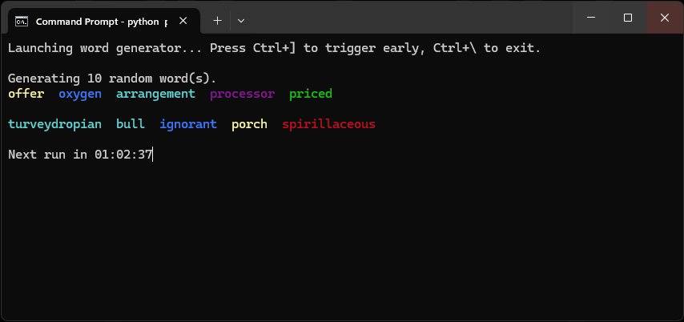

# 🔮 Wordmancy

**Wordmancy** is a magical, mystical tool that conjures random English words at random intervals or on-demand. It's great for inspiration.

There are two main components:
- `randomwords.py`: Displays randomly selected English words, interactively or by argument.
- `period.py`: A scheduler that triggers `randomwords.py` every 1–4 hours (or your custom interval), only when you’re **not gaming**.



---

## 📦 Features

- 🔡 Random word generation with colorized output  
- 🎛️ Command-line automation or interactive mode (press spacebar)  
- 🧠 Mostly common words, with rare ones appearing 1 in 8 times
  - Some common words come from Google search data, so names like "iPhone" or other proper nouns may appear
- 🕒 Periodic invocation via `period.py`, suspended while gaming  
- 🪄 Fully customizable  

---

## 🖥️ Requirements

Tested on **Windows 10+** with Python 3.8+.

Install dependencies:

```bash
pip install -r requirements.txt
```

---

## 🧰 Setup Instructions

### Step 1: Clone the Repo

```bash
git clone https://github.com/yourusername/wordmancy.git
cd wordmancy
```

### Step 2: Install NLTK Word Corpus

Run this once to download required NLTK data:

```python
import nltk
nltk.download('words')
nltk.download('names')
```

Or run this from the command line:

```bash
python -c "import nltk; nltk.download('words'); nltk.download('names')"
```

---

## 🚀 Usage

### 🔹 `randomwords.py` — Word Generator

#### Interactive Mode:

```bash
python randomwords.py
```

- Press `CTRL+]` to generate words.  
- Press `CTRL+\` to exit.

#### Automatic Mode:

```bash
python randomwords.py --count 20
```

- Outputs 20 random words and exits.  
- Output is colorized and grouped 5 per line.

---

### 🔹 `period.py` — Periodic Launcher

Runs `randomwords.py` at random intervals between 1 and 4 hours,  
but pauses while any known game is running (e.g., `eldenring.exe`).

Forces cmd window to the top if a fullscreen app isn't running.

```bash
python period.py
```

You can modify:
- Game names in `KNOWN_GAMES`
- Interval range in `wait_random_interval()`

It will:
- Launch `randomwords.py`
- Show a live countdown timer in the terminal
- Respect your gaming sessions

---

## 📝 Customization

You can modify:
- Word count
- Interval randomness
- Game detection list (also fullscreen app detection)
- Word rarity ratio (in `randomwords.py`)
- Colors used (via `colorama`)

---

## 🧠 Future Ideas

- [ ] GUI version  
- [ ] Save favorite words  
- [ ] Word definitions and parts of speech  
- [ ] Writing prompt generator  

---

## 🧙 About the Name

**Wordmancy**: from *word* + *-mancy* (divination) — the art of conjuring meaning from randomness.

---

## 🤖 Authorship Note

This project — from its functionality to this very README — was written 99% ENTIRELY via prompting by the GitHub repo owner, using ChatGPT as THE MAIN CONEWRITER.  
Think of it as AI-enhanced spellcraft for word nerds.
^ That's CGPT talking, from the author's opinon you should think of it as "just another -mancy."

---

## 📜 License

MIT License. Use it, fork it, remix it — just don’t cast curses with it.
